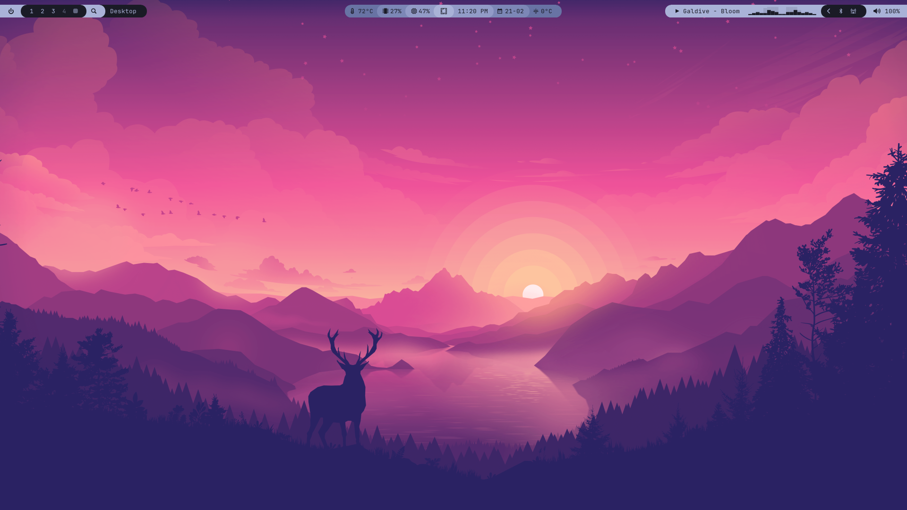
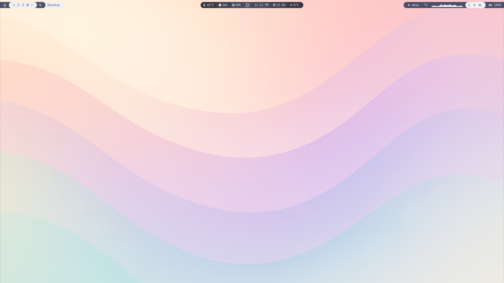
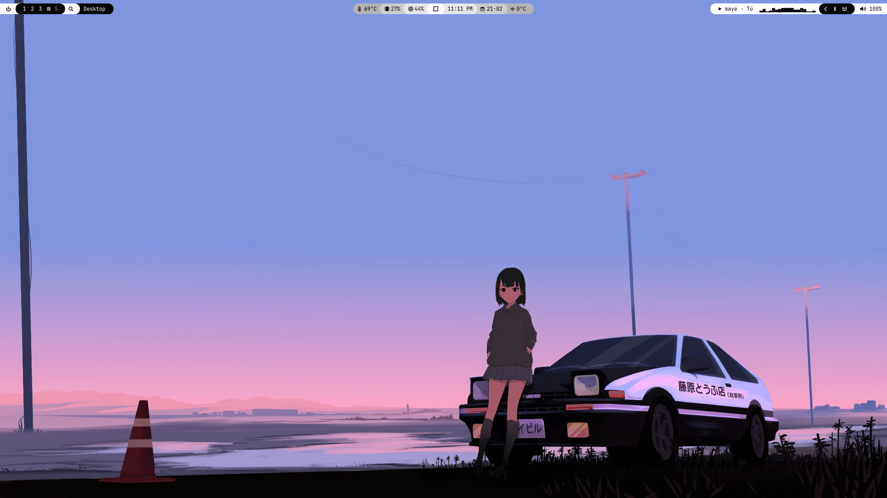

# My Personal Waybar Config

This is my Waybar config for Omarchy. Should be compatiable with other themes as well as 2k and 1080p monitors. 

## Dependencies

Install these tools before running (You shouldn't need to download these if you are running Omarchy):

- `waybar`
- `hyprland`
- `jq`
- `curl`
- `cava`
- `playerctl` (for MPRIS actions)

## Installation

1. Back up your current config:
   ```bash
   mv ~/.config/waybar ~/.config/waybar.backup
   ```
2. Clone this repo into your Waybar config path:
   ```bash
   git clone https://github.com/VincentDev21/Ling-Omarchy-Waybar.git ~/.config/waybar
   ```
3. Start or restart Waybar:
   ```bash
   pkill waybar
   waybar
   ```
## Preview V1
### Features
- Weather
- Calendar
- CPU usage
- RAM usage
- CPU temperature
- Hyprland window title
- Power menu
- MPRIS media info
- Cava audio visualizer
- App search
### Screenshots
#### Tokyo Night

#### Catppuchin Latte

#### Ghost Pastel [repo](https://github.com/row-huh/omarchy-ghost-pastel-theme)
